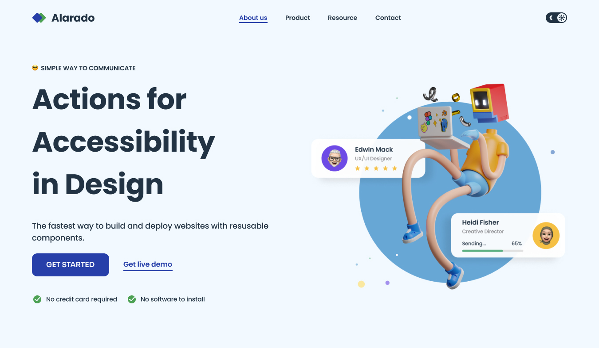

<!-- Please update value in the {}  -->

<h1 align="center">Simple Homepage | devChallenges</h1>

   Solution for a challenge <a href="https://devchallenges.io/challenge/simple-hompage-alarado" target="_blank">Simple Homepage - Alarado </a> from <a href="http://devchallenges.io" target="_blank">devChallenges.io</a>.

  <h3>
    <a href="https://maha6136.github.io/webpage/">
      Demo
    </a>
     | 
    <a href="https://maha6136.github.io/webpage/">
      Solution
    </a>
     | 
    <a href="https://devchallenges.io/challenge/simple-hompage-alarado">
      Challenge
    </a>
  </h3>

<!-- TABLE OF CONTENTS -->

## Table of Contents

- [Overview](#overview)
  - [What I learned](#what-i-learned)
- [Built with](#built-with)
- [Features](#features)
- [Contact](#contact)
- [Acknowledgements](#acknowledgements)

<!-- OVERVIEW -->

## Overview

### What I learned

I learned to do responsive web code in Tailwind CSS. And also learn to do toggle buttons in Javascript. It's pretty good to learn how to do dark mode transition.

### Built with

- Semantic HTML5 markup
- CSS custom properties
- Flexbox
- CSS Grid
- [Tailwind](https://tailwindcss.com/)

## Features

This application/site was created as a submission to a [DevChallenges](https://devchallenges.io/challenges-dashboard) challenge.

## Author

- Website [webpage](https://maha6136.github.io/webpage/)
- GitHub [@maah6136](https://github.com/maha6136)
